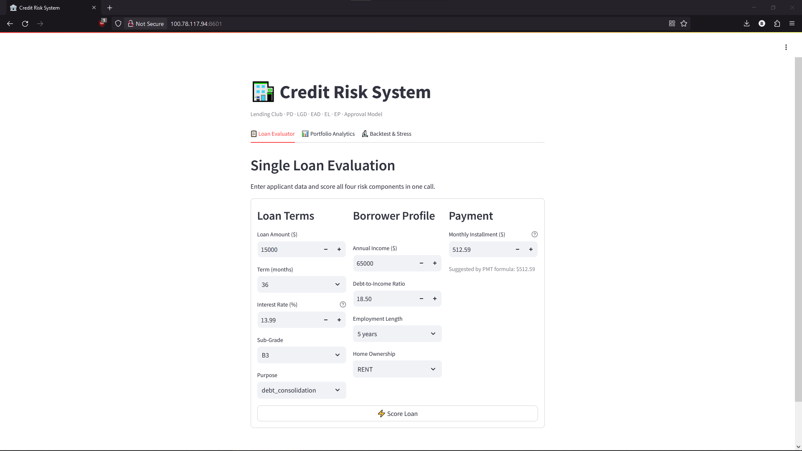
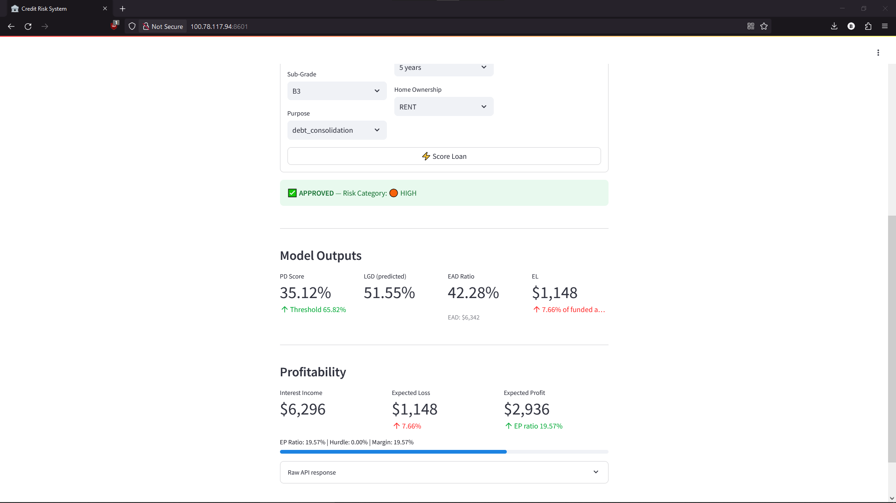
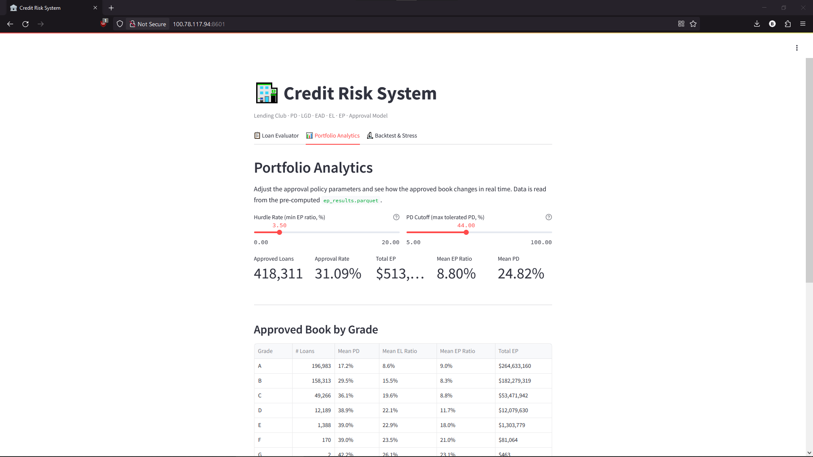
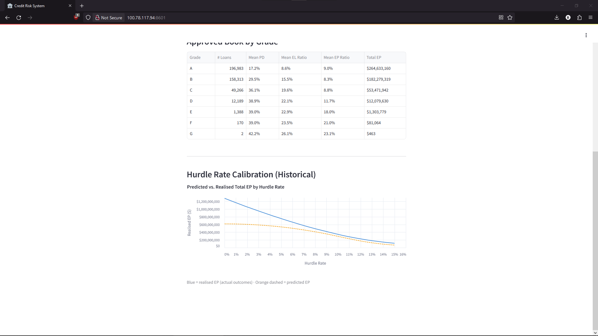
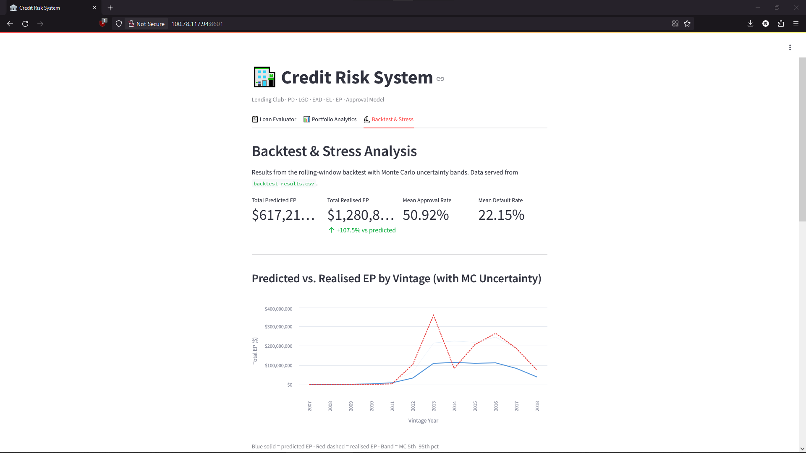
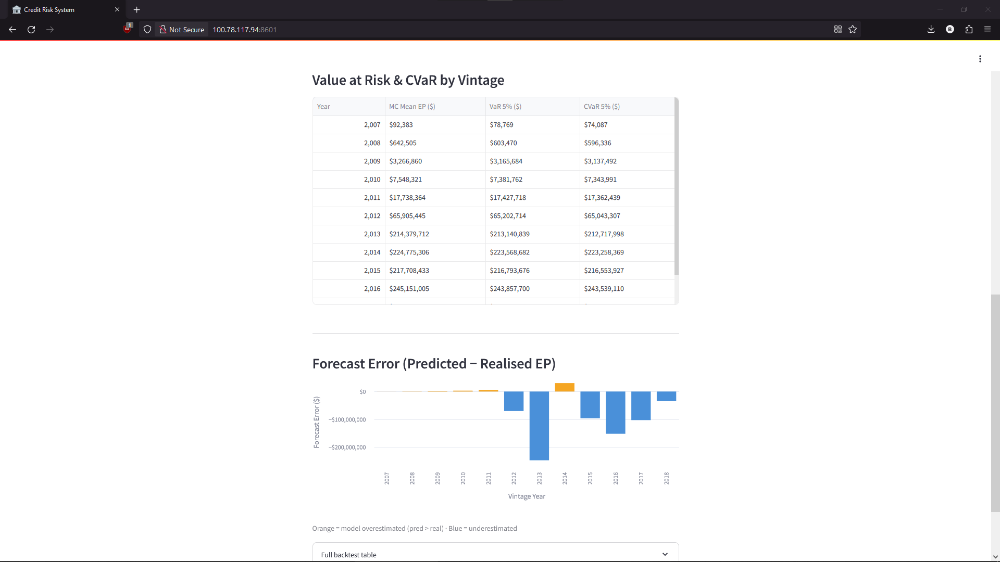

# 🏦 **Credit Risk Modeling — End-to-End Framework**
### *Probability of Default · Loss Given Default · Exposure at Default · Expected Loss · Expected Profit · Approval Policy · Full Model Validation*

> **Author:** Data Science Engineering Student  
> **Dataset:** Lending Club Accepted Loans 2007–2018Q4 · 2,260,701 observations  
> **Stack:** Python · XGBoost · Optuna · scikit-learn · NumPy · SciPy · pandas


## 📊 **Dashboard Preview**

<p align="center">
  
  
</p>
<p align="center">
  
  
</p>
<p align="center">
  
  
</p>

## 📖 **Overview**

This repository contains my full, end-to-end implementation of a credit risk quantification and decision-making framework built from scratch. I built every component myself — from raw data ingestion through model training, portfolio analytics, profitability analysis, and rigorous statistical validation — on a real-world dataset of over 2.26 million consumer loans.

The project follows the **Basel II/III Expected Loss paradigm**:

$$\text{EL} = \text{PD} \times \text{LGD} \times \text{EAD}$$

and extends it to a full **Expected Profit (EP) framework** with a data-driven credit approval policy. I then validated the entire system end-to-end using a rolling-window backtest, Monte Carlo uncertainty quantification, and macro stress testing — the kind of validation that separates a production-ready risk model from a notebook exercise.

---

## 🧠 **Research and Modeling**

| Notebook | What I did |
|---|---|
| `PD.ipynb` | Binary classifier on 1.3M loans. Built custom sklearn transformers (WoE encoder, Winsorizer, GradeTransformer). Time-based split. Tuned XGBoost with Optuna (60 Bayesian trials). **Test ROC-AUC: 0.701 · KS: 0.294** |
| `LGD.ipynb` | Regression on 268k defaulted loans only. OHE + Winsorizer pipeline. Optuna-tuned XGBoost. **MAE: 0.063 · Mean Bias ≈ 0** |
| `EAD.ipynb` | EAD ratio regression on defaulted loans. Verified 60-month loans have structurally higher EAD (0.782 vs 0.643). **Validation MAE: 0.161** |
| `EL.ipynb` | Assembled all three models to score the full 1.3M loan portfolio. EL Lorenz curve (Gini = 0.467) — top 20% of borrowers = 50.3% of losses. PD cutoff simulation & macro stress test. |
| `EP.ipynb` | Added revenue side. Derived per-loan break-even PD. Found EP-maximising cutoff (PD = 0.443 → $519M EP). **Portfolio raw EP: −$820M → shows why selection matters.** |
| `AprovalModel.ipynb` | EP-based approval rule with loan-specific PD threshold. **Outperforms flat PD cutoff by $56M on average, winning 82% of approval rate levels.** Serialised as `approval_model.pkl`. |
| `Simulations.ipynb` | Full validation |

---

## **Model Validation** (`Simulations.ipynb`)

This is the centrepiece of the project. I answered the hardest question: *would this policy have actually worked?*

**Realised EP** — recomputed EP for every loan using actual outcomes (`recoveries`, `total_rec_prncp`) instead of model predictions, then compared against predicted EP by vintage year to expose systematic model bias.

**Monte Carlo (1,000 trials)** — modelled PD, LGD, and EAD prediction uncertainty with Gaussian noise calibrated to *empirical residuals on held-out data* (not assumed). Produced a full distribution of portfolio EP outcomes with 5/25/75/95th percentile bands on the 620,933-loan approved book.

**Rolling Window Backtest** — for each origination year, I applied the approval policy using predictions, then evaluated performance using actual outcomes. The gap between predicted and realised EP per vintage quantifies where and when the model is optimistic.

**Hurdle Rate Recalibration** — swept a hurdle rate grid and found the rate that maximises *realised* EP (not predicted). When this differed from the predicted-optimal rate by >50bps, I exported a recalibrated model.

**Macro Stress Test** — applied 1.5×, 2.0×, and 3.0× PD shocks to the approved book and reran Monte Carlo under each scenario. Under a 3× shock, every percentile of the EP distribution is deeply negative.

## **Key Results**

| | |
|---|---|
| PD model (test) | ROC-AUC 0.701 · KS 0.294 · Brier 0.206 |
| LGD model | MAE 0.063 · Mean Bias ≈ 0 |
| Portfolio EL | $5.35B · 27.59% of funded amount |
| EP rule vs. PD cutoff | +$56M avg advantage · wins 82% of levels |
| MC simulation | 1,000 trials · 620,933-loan approved book |

---

## 💻 **Research Structure**

```
Research/                # Research & Development
├── PD.ipynb                # Scorecard development
├── LGD.ipynb               # Loss modeling
├── EAD.ipynb               # Exposure modeling
├── EL.ipynb                # Expected Loss aggregation
├── credit_risk_pipeline.py # Exportable Classes
├── AprovalModel.ipynb      # Profitability thresholds
└── Simulations.ipynb       # Model Validation
```

---

## 🏗️ **Architecture & Infrastructure**

The biggest challenge I set for myself was to simulate an AWS production environment without incurring cloud costs. To do this, I deployed the system on my Home Server using **Docker Compose** and **LocalStack**.

### The "Private Cloud" Setup
Instead of baking the `.pkl` model files inside the Docker image (which makes updates painful), I implemented an **Artifact Store pattern**:

1.  **S3 Emulation:** I run `LocalStack` to spin up a mock S3 bucket (`s3://credit-risk-models`).
2.  **Model Registry:** I use `awslocal` to sync my trained artifacts from the research environment to the bucket.
3.  **Inference Service:** When the FastAPI backend starts, it connects to this local S3 bucket to pull the latest model weights dynamically.

**Why this matters:** This is how actual MLOps teams work. Separate the Code (Git/Docker) from the Data/Artifacts (S3), allowing for model retraining without redeploying the entire application code.

---

## 📸 **Deployment**

The application is fully containerized and runs on my private server, accessible via Tailscale for secure remote access.

1. **The Decision Dashboard**
The frontend allows an analyst to input applicant data. It doesn't just say "Yes/No"—it provides the Risk-Adjusted Return metrics calculated by the pipeline.

2. **Live Inference Logs**
The system running on my home server. You can see the API initializing and pulling the specific model versions from the LocalStack S3 bucket.

---

## 💻 **Backend Structure**

```
Backend/
├── Dockerfile
├── docker-compose.yml
├── requirements.txt
├── main.py
├── frontend.py
├── credit_risk_pipeline.py
└── data/                        ← Local mount point (Synced to S3)
    ├── pd_preprocessor.pkl
    ├── pd_model.pkl
    ├── lgd_preprocessor.pkl
    ├── lgd_model.pkl
    ├── ead_preprocessor.pkl
    ├── ead_model.pkl
    ├── approval_model.pkl
    ├── ep_results.parquet
    ├── backtest_results.csv
    ├── hurdle_calibration.csv
    └── mean_rates_by_grade.json
```

---

